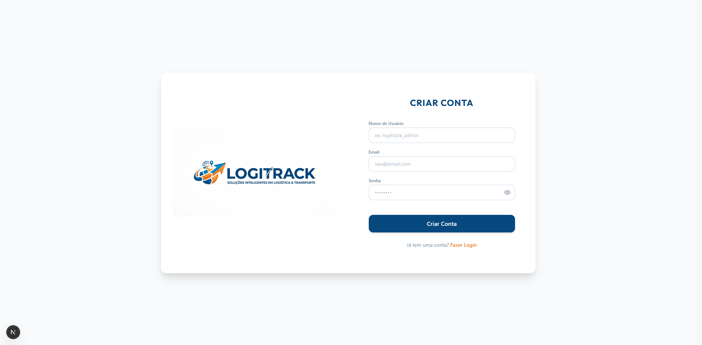
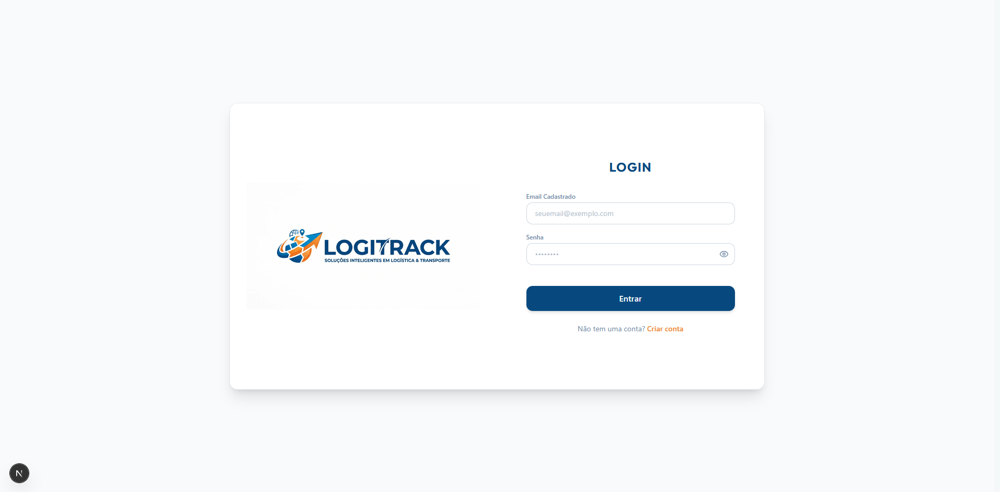
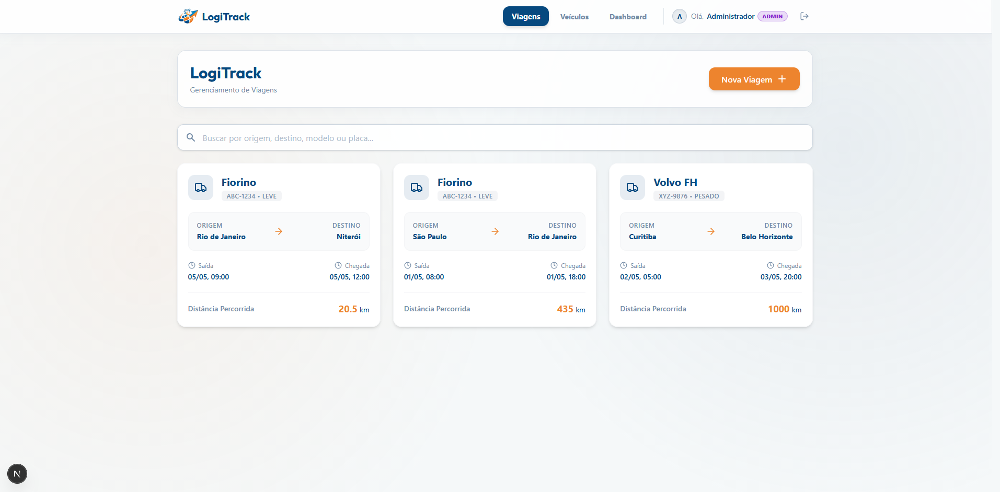
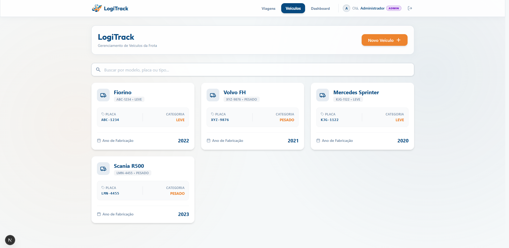
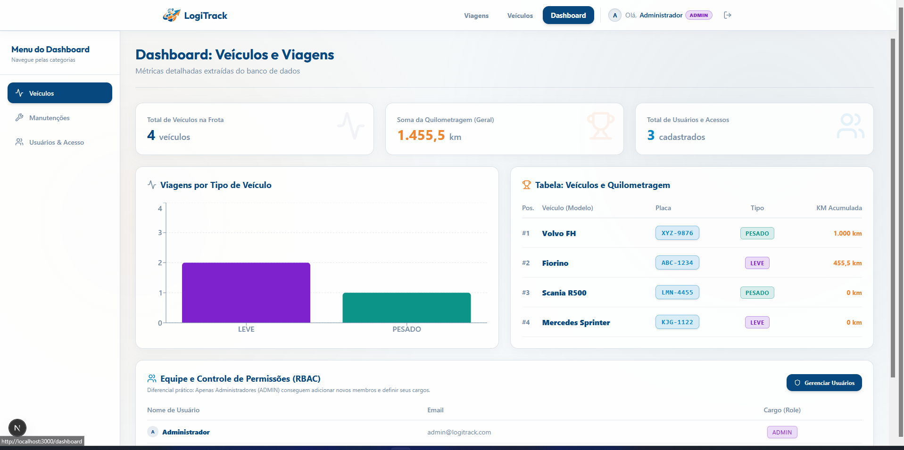
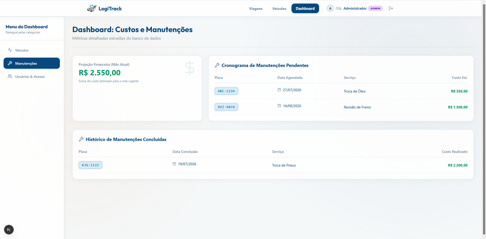
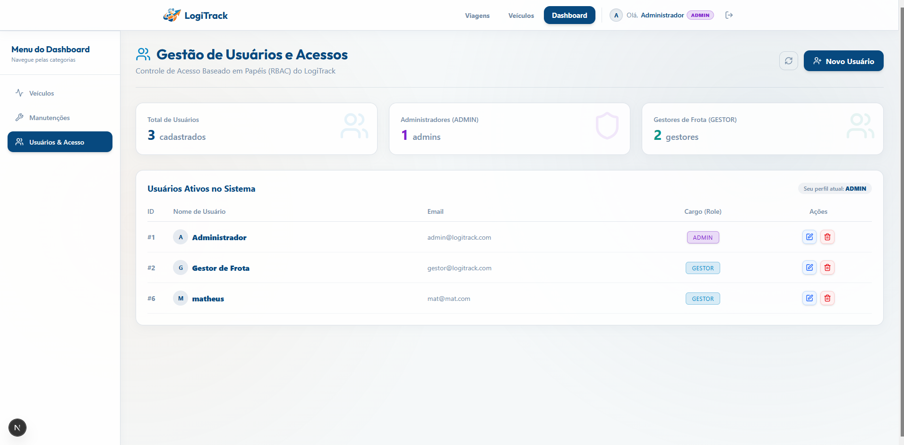

# LogiTrack — Gestão de Frota e Logística

[](https://spring.io/projects/spring-boot)
[](https://www.oracle.com/java/)
[](https://nextjs.org/)
[](https://react.dev/)
[](https://tailwindcss.com/)
[](https://www.postgresql.org/)
[](https://www.docker.com/)

O **LogiTrack** é um MVP desenvolvido para gestão de transportes e frotas de empresas logísticas. A plataforma centraliza o controle de veículos, agendamento de viagens e monitoramento de manutenções, desenvolvido como case técnico para a vaga de desenvolvimento de software.

---

## Índice

1. [Visão Geral do Projeto](#visão-geral-do-projeto)
2. [Tecnologias Utilizadas](#tecnologias-utilizadas)
3. [Arquitetura, POO e Decisões Técnicas](#arquitetura-do-projeto-e-separação-de-responsabilidades)
4. [Banco de Dados](#banco-de-dados-justificativas-e-script-sql)
5. [Como Configurar e Rodar Localmente](#como-configurar-e-rodar-localmente)
6. [Rotas API REST](#rotas-api-rest)
7. [Telas](#telas)

---

## Visão Geral do Projeto

### Principais Módulos Implementados:

- **Autenticação & Segurança (JWT):** Sistema de login com controle de acesso por roles (`ADMIN`, `GESTOR`), protegido contra acessos não autorizados via Spring Security.
- **CRUD Completo de Veículos:** Cadastro, edição, exclusão e listagem de veículos com classificação por categoria (`LEVE` e `PESADO`), placa, modelo e ano.
- **CRUD Completo de Viagens (Trips):** Agendamento e rastreamento de viagens associadas à frota, com controle de origem, destino, datas e quilometragem percorrida.
- **Dashboard :** Painel de inteligência de negócios com gráficos interativos e relatórios que apresentam:
  1. _Total de Quilometragem Acumulada da Frota._
  2. _Volume de Viagens por Tipo de Veículo (Leve vs. Pesado)._
  3. _Ranking de Utilização (Veículos com maior quilometragem registrada)._
  4. _Cronograma de Próximas Manutenções Pendentes (com datas e custos agendados)._
  5. _Projeção Financeira Mensal (soma de custos das manutenções previstas para o mês)._
  6. _Relação de usuários cadastrados (Gerenciamento de usuário CRUD)._

---

## Tecnologias Utilizadas

### **Backend**

- **Java 17**
- **Spring Boot 4.1.0**
- **Spring Data JPA & Hibernate:** ORM para gerenciamento de entidades relacional-objeto.
- **Spring Web & Spring Validation:** Mapeamento de endpoints e validação (DTOs).
- **Spring Security + JJWT:** Implementação de autenticação _stateless_ via JSON Web Tokens.
- **Spring JdbcTemplate:** Consultas SQL.
- **Lombok:** Redução de _boilerplate_ (Getters, Setters, Builders, Construtores).
- **Maven:** Gerenciador de dependências e build.

### **Frontend**

- **Next.js 16.2.11:** Framework React.
- **React 19.2.4 & TypeScript 5**
- **Tailwind CSS v4**

### **Banco de Dados & DevOps**

- **PostgreSQL 16:** Banco de dados relacional robusto para armazenamento da frota e métricas.
- **Docker & Docker Compose:** Containerização completa da aplicação (Backend + Frontend + Banco de Dados) para deploy e execução com um único comando.

---

## Arquitetura do Projeto e Separação de Responsabilidades

A arquitetura adotada é seguindo o modelo de Aplicaçação Desacoplada (Client-Server via API REST), baixo acoplamento e separação estrita de responsabilidades . Organizado como uma aplicação monorepo, unificando backend, frontend e banco de dados em um único repositório gerenciável.

```
vaga/ (Raiz do Projeto)
 ├── 📁 backend/       ➔ API RESTful em Spring Boot 3 / Java 21 (Regras de Negócio e Segurança)
 ├── 📁 frontend/      ➔ Single Page Application em Next.js 16 / React / TypeScript (UI & UX)
 └── 📁 database/      ➔ Scripts SQL nativos e orquestração de banco PostgreSQL
```

## BackEnd

O projeto foi estruturado seguindo rigorosamente as boas práticas de **Programação Orientada a Objetos (POO)**, **Princípios SOLID** (separação em camadas) e **Clean Architecture**:

```
logitrack/
 ├── controller/  # Camada HTTP REST: Recebe requisições, valida entradas e retorna DTOs de resposta
 ├── service/     # Camada de Negócios: Contém regras de validação, agendamento e processamento
 ├── repository/  # Camada de Dados: JPA/Hibernate para CRUD e JdbcTemplate para SQL Analítico
 ├── model/       # Entidades do Domínio: Veículo, Viagem, Usuário
 ├── dto/         # Objetos de Transferência: Blindam o banco de dados contra vazamento de estrutura
 ├── security/    # Filtros JWT, Provedor de Autenticação e Configurações CORS/Security
 └── exception/   # GlobalExceptionHandler (@ControllerAdvice) para tratamento centralizado de erros
```

## FrontEnd

A interface web foi estruturada utilizando **Next.js 16 (App Router)**, **React 19**, **TypeScript** e **Tailwind CSS**, focando em modularidade de componentes, separação clara entre lógica de API e visualização, e design responsivo:

```
app/
 ├── auth/        # Rotas de Autenticação: Tela de Cadastro com validação de formulários e gestão de sessão
 ├── components/  # Componentes Reutilizáveis: Modais, Sidebar, Navbar, Gráficos (Recharts) e Badges de status
 ├── dashboard/   # Tela de dashboard analítica
 ├── services/    # Camada de Comunicação HTTP: Cliente API (Axios/Fetch) centralizado com interceptores JWT
 ├── trips/       # Módulo Operacional de Viagens: Telas CRUD para agendamento
 ├── vehicles/    # Módulo Operacional de veículos: Telas CRUD para gestão de veículos
 └── utils/       # Utilitários e Helpers: Formatação de moedas/datas e validações de permissão
```

## Banco de Dados (Justificativas e Script SQL)

O esquema original do banco de dados precisou ser alterado para atender os requisitos de autenticação segura e as métricas financeiras/cronograma exigidas para o MVP.

### Alterações na Base de dados:

- **Tabela `usuarios`:** Criada para armazenar credenciais de acesso, _hash_ de senha (criptografado via BCrypt) e níveis de permissão (`role`), viabilizando a proteção dos endpoints via Spring Security + JWT.

### Adições ao Script SQL

O script abaixo recria o banco de dados e insere dados iniciais (seed) para experimentação imediata do Dashboard:

```sql
--  Criação da Tabela de Usuários (Autenticação)
CREATE TABLE usuarios (
    id BIGSERIAL PRIMARY KEY,
    username VARCHAR(255) UNIQUE NOT NULL,
    email VARCHAR(255) UNIQUE,
    password_hash VARCHAR(255) NOT NULL,
    role VARCHAR(50) NOT NULL
);

-- Inserindo Usuários (Autenticação e Acesso RBAC)
INSERT INTO usuarios (username, email, password_hash, role) VALUES
('Administrador', 'admin@logitrack.com', '$2b$10$RjhmgXqO9iNH9hm9wX0fcOFeQafRbaEyhzKGTxyipVyNzV9nqYjmq', 'ADMIN'),
('Gestor de Frota', 'gestor@logitrack.com', '$2b$10$VVl3zj0BJ4ieFaUoTChOA.SCH95aOA.QvBD3qfGWhfQIvPaqNg8A2', 'GESTOR');

```

---

## Como Configurar e Rodar Localmente

### Rodar via Docker & Docker Compose

**PRÉ-REQUISITOS:** Ter o [Docker](https://www.docker.com/) e o `docker-compose` instalados em sua máquina.

1. Clone o repositório e acesse a pasta raiz do projeto:

   ```bash
   git clone https://github.com/seu-usuario/logitrack.git
   cd logitrack
   ```

2. Crie o arquivo de configuração `.env` a partir do exemplo:
   Faça uma cópia do exemplo e coloque as variáveis para inicialização, e depois o renomeie para .env

   ```bash
   cp .example_env .env
   ```

   Preencha o mesmo conforme está no exemplo

3. **Inicie utilizando os scripts de automação :**
   Para facilitar a execução local sem precisar memorizar os comandos do Docker, preparamos scripts automatizados para cada sistema operacional:
   - **No Windows (via Prompt de Comando ou PowerShell):**
     - Para **iniciar** todos os containers (Build + Subida em 2º plano):
       ```cmd
       .\script_init_windows\start.bat
       ```
     - Para **parar e desligar** o ambiente:
       ```cmd
       .\script_init_windows\stop.bat
       ```

   - **No Linux (via Terminal Bash):**
     - Dê permissão de execução (apenas na primeira vez):
       ```bash
       chmod +x ./script_init_linux/*.sh
       ```
     - Para **iniciar** todos os containers:
       ```bash
       ./script_init_linux/start.sh
       ```
     - Para **parar e desligar** o ambiente:
       ```bash
       ./script_init_linux/stop.sh
       ```

   - **⚙️ Ou via comando Docker puro (qualquer sistema):**
     ```bash
     docker compose up --build -d
     ```

4. **Acesse a aplicação:**
   - **Frontend Web (UI):** [http://localhost:3000](http://localhost:3000)
   - **Backend API REST:** [http://localhost:8080/api](http://localhost:8080/api)
   - **Banco de Dados PostgreSQL:** `localhost:5432` (foi utilizado a extenção do vscode "Database Client" para alterar diretamente no banco de dados)

---

## Credenciais de Demonstração (Login)

Ao iniciar o banco de dados pelo Docker, o script SQL de inicialização (`init.sql`) já popula automaticamente o sistema com dois usuários com senhas criptografadas para que você possa testar todos os níveis de permissão de forma imediata:

- Administrador (Acesso Total): `admin@logitrack.com` | **Senha:** `admin123`
- Gestor de Frota (Restrito): `gestor@logitrack.com` | **Senha:** `gestor123`

---

## Rotas API REST

A API retorna respostas JSON e é padronizada com HTTP Status Codes (200, 201, 204, 400, 401, 404, 500).

| Módulo        |  Método  | Endpoint                  | Descrição                                                                   |
| :------------ | :------: | :------------------------ | :-------------------------------------------------------------------------- |
| **Auth**      |  `POST`  | `/api/auth/login`         | Realiza login e retorna token JWT em _cookie HTTPOnly_ e JSON               |
| **Auth**      |  `POST`  | `/api/auth/register`      | Cadastra novo usuário no sistema                                            |
| **Auth**      |  `GET`   | `/api/auth/me`            | Retorna os dados do usuário autenticado                                     |
| **Auth**      |  `POST`  | `/api/auth/logout`        | Invalida a sessão/cookie do usuário                                         |
| **Usuários**  |  `GET`   | `/api/users`              | Lista todos os usuários e cargos do sistema (Exclusivo ADMIN)               |
| **Usuários**  |  `POST`  | `/api/users`              | Cadastra um novo usuário definindo seu cargo (Exclusivo ADMIN)              |
| **Usuários**  |  `PUT`   | `/api/users/{id}`         | Edita nome, e-mail, senha ou cargo de um usuário (Exclusivo ADMIN)          |
| **Usuários**  | `DELETE` | `/api/users/{id}`         | Remove um usuário do sistema com validação anti-autoexclusão (ADMIN)        |
| **Veículos**  |  `GET`   | `/api/vehicles`           | Lista todos os veículos da frota cadastrados                                |
| **Veículos**  |  `GET`   | `/api/vehicles/{id}`      | Busca os detalhes de um veículo específico por ID                           |
| **Veículos**  |  `POST`  | `/api/vehicles`           | Cadastra um novo veículo na frota                                           |
| **Veículos**  |  `PUT`   | `/api/vehicles/{id}`      | Atualiza os dados de um veículo existente                                   |
| **Veículos**  | `DELETE` | `/api/vehicles/{id}`      | Remove um veículo da frota (e suas viagens/manutenções via Cascade)         |
| **Viagens**   |  `GET`   | `/api/trips`              | Lista o histórico completo de viagens agendadas e concluídas                |
| **Viagens**   |  `GET`   | `/api/trips/vehicle/{id}` | Lista as viagens vinculadas a um veículo específico                         |
| **Viagens**   |  `POST`  | `/api/trips`              | Registra/agenda uma nova viagem para um veículo                             |
| **Viagens**   |  `PUT`   | `/api/trips/{id}`         | Edita os dados de uma viagem agendada                                       |
| **Viagens**   | `DELETE` | `/api/trips/{id}`         | Cancela e remove um registro de viagem                                      |
| **Dashboard** |  `GET`   | `/api/dashboard/summary`  | Retorna todas as 5 métricas agregadas em uma única requisição               |
| **Dashboard** |  `GET`   | `/api/dashboard/totalkm`  | Retorna a soma de KM percorrida pela frota (com filtro opcional de veículo) |

---

## Esquema de interação entre camadas

```
       [ Usuário Web ]
             │ (HTTP REST / JWT)
             ▼
   ┌───────────────────┐
   │ Next.js Frontend  │  (Porta 3000 - UI & Gráficos com Recharts)
   └─────────┬─────────┘
             │ (JSON Request/Response)
             ▼
   ┌───────────────────┐
   │ Spring Boot API   │  (Porta 8080 - Validações POO, Security, DTOs)
   └─────────┬─────────┘
             │ (JPA / JdbcTemplate RAW SQL)
             ▼
   ┌───────────────────┐
   │ PostgreSQL DB     │  (Porta 5432 - Persistência, Constraints, Group By)
   └───────────────────┘
```

# Telas

## Tela de cadastro



## Tela de Login



## Tela de Viagens




## Tela de Veículos




## Telas Dashboard




